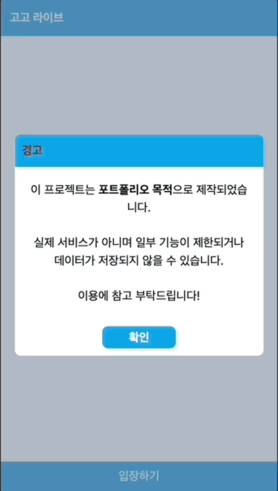

# GOGO_LIVE

## ✅ 개요

1:1 랜덤 채팅 서비스인 가가라이브를 모티브로 작성한 개인 포트폴리오용 프로젝트입니다.

<!-- 이미지 -->

## ✅ 기능

### 랜덤 사용자 매칭

대기자가 없을 경우 대기큐에 추가하여 대기상태로 머물다가  
새로운 대기자가 들어올 경우 대기큐에서 가장 오래 머문 사람부터 대화가 매칭됩니다.

### 실시간 채팅

socket.io를 이용하여 실시간 양방향 채팅 기능을 구현하였습니다.

### 입력중 표출

상대방이 입력중일 때 입력중임을 알 수 있습니다.

## 사용 스택

### Typescript

타입 안정성을 위하여 타입스크립트를 적용하였습니다.

### React 18

Web UI JS Library

### Node + Express

Javascript Engine + Framework

### Web Socket

실시간 양방향 통신을 위한 웹 소켓 사용

### Tailwind

유틸리티 CSS 라이브러리

## ✅ To Do

☑️ 서버 배포 필요

- Vercel과 같은 서버리스 플랫폼에서는 소켓 연결이 끊기는 문제가 있어 추후 서버 배포 필요
